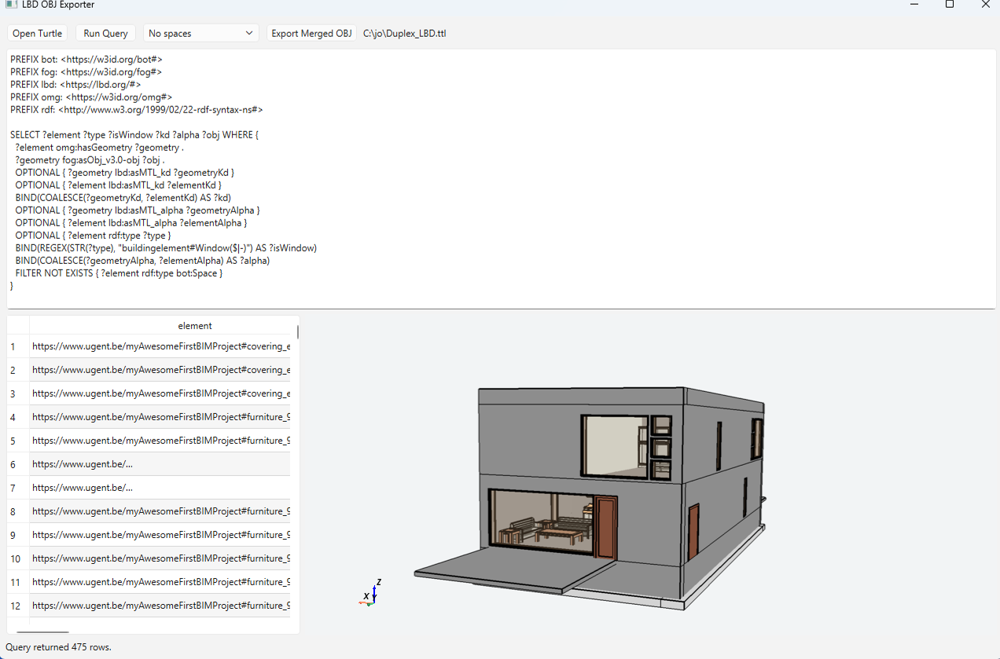

# LBD OBJ Exporter

LBD OBJ Exporter is a small Python desktop application for selecting an LBD Turtle file, querying it with SPARQL, previewing the merged geometry, and exporting all geometry returned by the query into a single merged Wavefront OBJ file.



It expects geometry literals in the IFCtoLBD/FoG form:

```sparql
?element <https://w3id.org/omg#hasGeometry> ?geometry .
?geometry <https://w3id.org/fog#asObj_v3.0-obj> ?obj .
OPTIONAL { ?geometry <https://lbd.org/#asMTL_kd> ?geometryKd }
OPTIONAL { ?element <https://lbd.org/#asMTL_kd> ?elementKd }
BIND(COALESCE(?geometryKd, ?elementKd) AS ?kd)
```

The `?obj` value must be a base64-encoded OBJ literal, as produced by the geometry-enabled IFCtoLBD conversion examples.

## Requirements

- Python 3.10 or newer
- `rdflib`
- `numpy`
- `pyvista`
- `pyvistaqt`
- `pyside6`

Create a local virtual environment and install the dependencies from this folder:

```bash
python3 -m venv .venv
.venv/bin/python -m pip install -r requirements.txt
```

## Run

From this folder:

```bash
.venv/bin/python -m lbd_obj_exporter
```

Or from the repository root:

```bash
PYTHONPATH=LBD_OBJ_Exporter LBD_OBJ_Exporter/.venv/bin/python -m lbd_obj_exporter
```

## Use

1. Click **Open Turtle** and select a `.ttl` file.
2. Edit the example SPARQL query if needed.
3. Click **Run Query**.
4. Inspect the shaded 3D OBJ preview on the right side of the result area.
5. Click **Export Merged OBJ** and choose the output `.obj` file.

All OBJ fragments in the query results are merged into one file, and face indices are adjusted. Duplicate geometry rows for the same element are skipped, which is useful when a query returns one row per RDF type.

The preview is rendered with PyVista/VTK through a Qt widget. It uses a slightly transparent two-sided material and disables mesh-edge display. If the query result has a `kd` binding from `<https://lbd.org/#asMTL_kd>`, that diffuse colour is used for the element. The default query accepts the color from either the geometry node or the element node. Missing or invalid colors fall back to the default material.

Viewer actions:

- Drag with the left mouse button to rotate.
- Drag with the middle or right mouse button to pan.
- Use the mouse wheel to zoom.
- Click **Reset View** to restore the default camera.

## Example Query

```sparql
PREFIX bot: <https://w3id.org/bot#>
PREFIX fog: <https://w3id.org/fog#>
PREFIX lbd: <https://lbd.org/#>
PREFIX omg: <https://w3id.org/omg#>
PREFIX rdf: <http://www.w3.org/1999/02/22-rdf-syntax-ns#>

SELECT ?element ?type ?kd ?obj WHERE {
  ?element omg:hasGeometry ?geometry .
  ?geometry fog:asObj_v3.0-obj ?obj .
  OPTIONAL { ?geometry lbd:asMTL_kd ?geometryKd }
  OPTIONAL { ?element lbd:asMTL_kd ?elementKd }
  BIND(COALESCE(?geometryKd, ?elementKd) AS ?kd)
  OPTIONAL { ?element rdf:type ?type }
}
```

The app hides the `obj` column in the result table because it is usually very large, but all `obj` bindings are still used for export.

## Test

```bash
.venv/bin/python -m unittest discover -s tests
```

## Example File

`examples/two_boxes.ttl` contains two tiny base64 encoded OBJ fragments for a quick smoke test.
